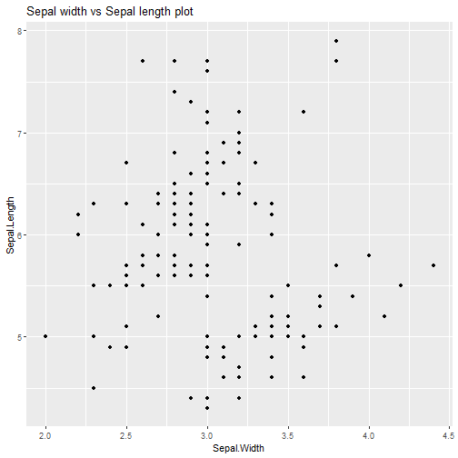

Peer-graded Assignment: Course Project: Shiny Application and Reproducible Pitch
========================================================
author: Manan Vohra
date: August 20 2021
autosize: true

Introduction
========================================================

Your Shiny Application

1 Write a shiny application with associated supporting documentation. The documentation       should be thought of as whatever a user will need to get started using your application.

2 Deploy the application on Rstudio's shiny server

3 Share the application link by pasting it into the provided text box

4 Share your server.R and ui.R code on github
  
How to use this application
========================================================

Using the Iris data set, we plot Sepal width vs Sepal length scatter plot for  the selected specie from dropdown.

Link to the application : https://mananvoh.shinyapps.io/project_9_3/

Link to the application code on github 

UI : https://github.com/mananvohra16/datasciencecoursera/blob/gh-pages/Course%209/ui.R

Server : https://github.com/mananvohra16/datasciencecoursera/blob/gh-pages/Course%209/server.R


Data set summary
========================================================


```r
summary(iris)
```

```
  Sepal.Length    Sepal.Width     Petal.Length    Petal.Width   
 Min.   :4.300   Min.   :2.000   Min.   :1.000   Min.   :0.100  
 1st Qu.:5.100   1st Qu.:2.800   1st Qu.:1.600   1st Qu.:0.300  
 Median :5.800   Median :3.000   Median :4.350   Median :1.300  
 Mean   :5.843   Mean   :3.057   Mean   :3.758   Mean   :1.199  
 3rd Qu.:6.400   3rd Qu.:3.300   3rd Qu.:5.100   3rd Qu.:1.800  
 Max.   :7.900   Max.   :4.400   Max.   :6.900   Max.   :2.500  
       Species  
 setosa    :50  
 versicolor:50  
 virginica :50  
                
                
                
```

Sepal width vs Sepal length scatter plot for all species
========================================================



